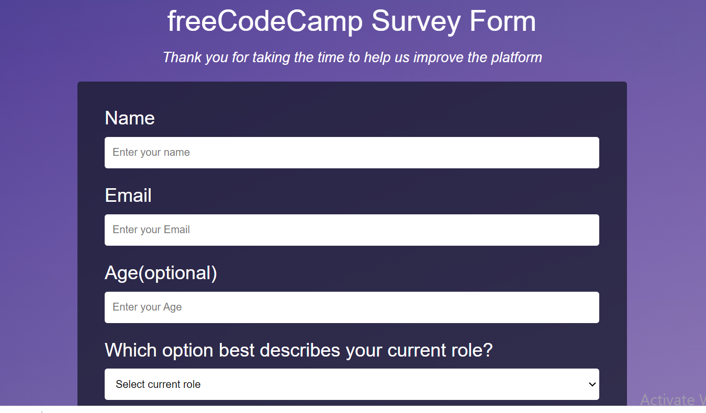

# SURVEY PAGE

## Project Review

## About
This project is a simple survery form for freeCodeCamp.

## BUILT WITH
This page is built with 
* HTML and
* CSS.

### PREREQUISITES
* A stable browser.
* Internet connection
* Familiarity with GitHub

## CLONE PROJECT
* open your terminal
* type and run this comand (`git clone git@github.com:boanong/survey-page.git`)
* change to the project directory by entering: cd My-food
* Note That: all this is done using your Linux terminal or git-bash for windows users.

## Command-line steps

- $ git clone `https://github.com/boanong/survey-page`
- $ `cd survey-page`
- $ `git checkout feature/head`

## CONTRIBUTION
Contributions, issues, and feature requests are welcome!
Feel free to check the [issues page](https://github.com/boanong/survey-page/issues).

## Live Site

[Link](https://boanong.github.io/survey-page/)

## AUTHOR
**JOSH**
- GitHub: [@boanong](https://github.com/BoanongJoshua)

## License
This project is [w3school](./LICENSE) licensed. This project was made by "JOSHUA"